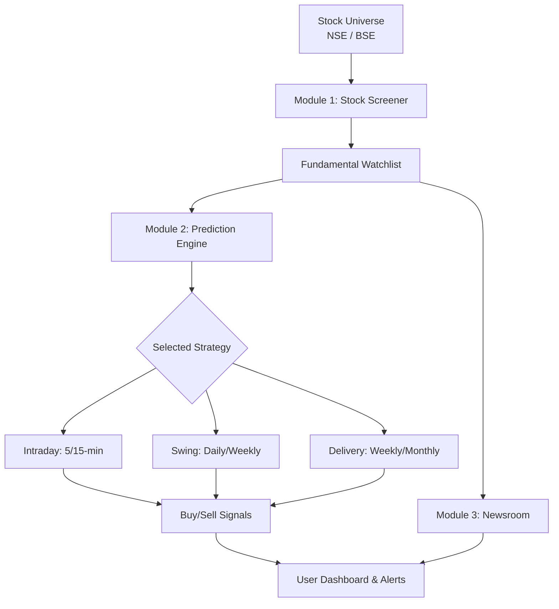

# Stock Market Screening & Prediction System (NSE/BSE)

## 1) Goal (Simple Definition)
Build a system that **screens Indian stocks** and gives **rule-based predictions** using:

- Technical indicators (EMA, RSI, MACD, VWAP)
- Fundamental metrics (PE, EPS, ROE, Debt-Equity, etc.)
- News sentiment analysis

This is **not heavy machine learning**. It is a **transparent rule-based system** suitable for academic projects.

---

## 2) Step-by-Step Architecture (Simple)

### Diagram (based on provided flow)



### Step 1: Data Collection Layer
Collect data from free APIs:

- **Prices/Volume** (NSE/BSE)
- **Fundamentals** (PE, EPS, ROE, Debt-Equity)
- **News headlines**

Store raw data in database.

### Step 2: Indicator Engine
Compute indicators from price data:

- EMA (fast/slow)
- RSI
- MACD
- VWAP

### Step 3: Fundamental Filter
Apply basic financial health rules:

- Reasonable PE
- Positive EPS growth
- ROE above threshold
- Debt-Equity below threshold

### Step 4: News Sentiment
Analyze headlines and tag them as **positive/negative/neutral**.

### Step 5: Rule-Based Scoring
Combine **technical + fundamental + sentiment** into a score.

### Step 6: API + Frontend
Expose results via Django REST API and show in React UI.

---

## 3) High-Level Project Architecture

```
Frontend (React)
    |
    v
Backend (Django REST API)
    |
    v
Database (PostgreSQL/SQLite)
    |
    v
Data Sources (APIs + CSV datasets)
```

**Main modules:**

1. **Data Ingestion Module**
2. **Indicator Calculator**
3. **Fundamental Screener**
4. **Sentiment Analyzer**
5. **Rule Engine**
6. **REST API**
7. **Frontend UI**

---

## 4) Rule-Based Prediction Logic (Core of System)

### 4.1 Technical Rules (Example)

**EMA Crossover**
- If EMA(12) > EMA(26) → Bullish (+1)
- If EMA(12) < EMA(26) → Bearish (-1)

**RSI**
- RSI < 30 → Oversold (Bullish +1)
- RSI > 70 → Overbought (Bearish -1)

**MACD**
- MACD > Signal → Bullish (+1)
- MACD < Signal → Bearish (-1)

**VWAP**
- Price > VWAP → Bullish (+1)
- Price < VWAP → Bearish (-1)

### 4.2 Fundamental Rules (Example)

- PE < 25 → Good (+1)
- EPS growth > 10% → Good (+1)
- ROE > 15% → Good (+1)
- Debt-Equity < 1 → Good (+1)

### 4.3 News Sentiment Rules

- Positive sentiment → +1
- Negative sentiment → -1

### 4.4 Final Decision

Total score (example):

- **Score ≥ +4** → BUY
- **Score between +1 and +3** → WATCH
- **Score ≤ 0** → SELL/AVOID

---

## 5) Backend API Design (Python + Django)

### 5.1 Main Django Apps

- `market_data` → price/history data
- `fundamentals` → financial ratios
- `sentiment` → news sentiment
- `screening` → scoring + predictions

### 5.2 Example Models

**Stock**
- symbol (RELIANCE, TCS)
- name
- exchange (NSE/BSE)

**PriceData**
- stock (FK)
- date
- open, high, low, close, volume

**FundamentalData**
- stock (FK)
- pe, eps, roe, debt_equity

**NewsSentiment**
- stock (FK)
- headline
- sentiment_score
- date

**Prediction**
- stock (FK)
- score
- label (BUY/WATCH/SELL)
- created_at

### 5.3 Example API Endpoints

- `GET /api/stocks/` → list stocks
- `GET /api/stocks/{symbol}/` → details
- `GET /api/stocks/{symbol}/indicators/` → EMA/RSI/MACD/VWAP
- `GET /api/stocks/{symbol}/fundamentals/`
- `GET /api/stocks/{symbol}/sentiment/`
- `GET /api/stocks/{symbol}/prediction/`

---

## 6) Frontend Implementation (React + HTML/CSS/JS)

### 6.1 Pages

1. **Dashboard** → list all screened stocks
2. **Stock Detail Page** → charts + indicators
3. **Prediction Summary** → BUY/WATCH/SELL

### 6.2 React Components

- `StockTable` → list with filter/sort
- `StockCard` → snapshot
- `IndicatorChart` → EMA/MACD/RSI
- `SentimentList` → news with sentiment tag

### 6.3 API Integration

Use **Axios** to call Django API:

```js
axios.get("/api/stocks/RELIANCE/prediction/")
  .then(res => setPrediction(res.data));
```

---

## 7) Free APIs / Datasets (India Focused)

### Prices
- **Yahoo Finance (via yfinance)**
- **Alpha Vantage (free tier)**
- **NSE India unofficial APIs**

### Fundamentals
- **Screener.in (manual export)**
- **Financial Modeling Prep (limited)**

### News
- **NewsAPI.org (free tier)**
- **GNews API**

### Sentiment
- **VADER sentiment (Python, free)**

---

## 8) Limitations

- Free APIs have **rate limits**
- Fundamentals may be outdated
- News sentiment is **noisy**
- Rule-based system cannot capture all market behavior
- Not suitable for real trading without risk management

---

## 9) Future Improvements

- Add **backtesting**
- Add **risk management rules**
- Include **sector-based filters**
- Use **intraday data**
- Optional ML models after baseline rules

---

## 10) Academic Presentation Tips

- Clearly explain each indicator formula
- Show example calculations
- Use flowcharts and data pipeline diagrams
- Provide sample input/output JSON from API
- Add limitations & future scope slides

---

## 11) Rule-Based Prediction Logic (Intraday, Swing, Delivery)

This section adds **detailed, rule-based strategies** with **no machine learning**. The logic is transparent and suited for academic evaluation.

### 11.1 Intraday Trading Module (5-min / 15-min)

**Objective:** Quick momentum capture using **technical + S/R + trend**.

**Indicators Used:** EMA 9, EMA 21, VWAP, RSI(14), Volume, Support/Resistance (Prev. day High/Low, pivots).

**BUY Rules (ALL must satisfy):**

| Category | Condition | Why it matters |
|---|---|---|
| Trend | Price > VWAP | Shows intraday bullish bias |
| Trend | EMA 9 > EMA 21 | Short-term momentum |
| Trend | EMA slope upward | Confirms trend strength |
| S/R | Price near intraday support **OR** breakout above resistance with volume | Low-risk entry or breakout validation |
| Momentum | RSI between 55–70 | Strength but not overbought |
| Volume | Volume > 1.5× avg volume | Confirms participation |

**SELL / EXIT Rules (any one):**

| Condition | Meaning |
|---|---|
| EMA 9 crosses below EMA 21 | Momentum loss |
| Price < VWAP | Trend reversal |
| RSI < 45 | Weakness |

**Risk Management:**

| Parameter | Value |
|---|---|
| Stop Loss | 0.5% |
| Target | 1%–1.5% |
| Risk–Reward | ≥ 1:2 |

**Intraday Example:**

| Signal Input | Value | Pass? |
|---|---|---|
| Price vs VWAP | 205 > 201 | ✅ |
| EMA 9 vs EMA 21 | 204 > 202 | ✅ |
| EMA slope | Rising | ✅ |
| RSI(14) | 62 | ✅ |
| Volume | 1.7× avg | ✅ |
| S/R | Breakout above prev. high | ✅ |
| Decision | **BUY** | ✅ |

---

### 11.2 Swing Trading Module (Daily)

**Objective:** Multi-day trend capture.

**Indicators Used:** EMA 20, EMA 50, MACD, RSI(14), Volume, Weekly Support/Resistance.

**BUY Rules:**

| Category | Condition | Why it matters |
|---|---|---|
| Trend | EMA 20 > EMA 50 | Medium-term uptrend |
| Trend | Price above both EMAs | Confirms strength |
| Structure | Higher Highs / Higher Lows | Trend continuity |
| S/R | Bounce from weekly support **OR** breakout above weekly resistance | Valid entry zone |
| Momentum | MACD bullish crossover | Trend acceleration |
| Momentum | RSI > 55 | Strength |
| Volume | Expansion on breakout | Confirms demand |

**SELL / EXIT Rules (any one):**

| Condition | Meaning |
|---|---|
| EMA 20 crosses below EMA 50 | Trend reversal |
| MACD bearish crossover | Momentum loss |
| Breakdown below support | Structural weakness |

**Risk Management:**

| Parameter | Value |
|---|---|
| Stop Loss | 3%–5% |
| Target | 8%–20% |
| Holding | 5–30 days |

**Swing Example:**

| Signal Input | Value | Pass? |
|---|---|---|
| EMA 20 vs EMA 50 | 512 > 495 | ✅ |
| Price vs EMAs | Above both | ✅ |
| Structure | HH/HL | ✅ |
| MACD | Bullish crossover | ✅ |
| RSI | 58 | ✅ |
| Volume | 1.4× avg | ✅ |
| Decision | **BUY** | ✅ |

---

### 11.3 Delivery / Long-Term Module (Weekly + Daily)

**Objective:** Wealth creation with **technical + fundamental + sector-wise filters**.

**Technical Rules:**

| Category | Condition | Why it matters |
|---|---|---|
| Trend | Price > 200-DMA | Long-term bullish |
| Trend | EMA 50 > EMA 200 (Golden Cross) | Strong uptrend |
| S/R | Price near long-term support | Low-risk entry |
| S/R | No major resistance overhead | Upside space |

**Fundamental Rules (Sector-wise):**

| Sector | Key Filters |
|---|---|
| Banking/Finance | ROE > 15%, NPA < 3%, Debt-Equity < 8, Profit growth 3 yrs |
| IT | ROE > 18%, Debt-free/low debt, Revenue CAGR > 10%, Strong margin |
| Pharma | ROE > 12%, Low debt, Positive cash flow, R&D consistency |
| Infra/Capital Goods | Order book growth, D/E < 1.5, ROCE > 15%, Govt capex exposure |
| FMCG | ROE > 20%, Stable growth, Low volatility, Brand moat |

**Sentiment Filter (optional but strong):**

| Rule | Impact |
|---|---|
| No major negative news | Avoid sudden drawdowns |
| Sector outlook positive | Aligns with macro tailwinds |
| Earnings sentiment ≥ neutral | Reduces surprise risk |

**Delivery BUY Decision (final):**

| Required Condition | Status |
|---|---|
| Technical trend bullish | Must pass |
| Fundamentals strong (sector-wise) | Must pass |
| Support zone respected | Must pass |
| Market index trend positive | Must pass |

**Risk Management:**

| Parameter | Value |
|---|---|
| Stop Loss | 10%–15% |
| Target | 25%–60% |
| Holding | 6 months – 3 years |

**Delivery Example:**

| Signal Input | Value | Pass? |
|---|---|---|
| Price vs 200-DMA | Above | ✅ |
| EMA 50 vs EMA 200 | Golden cross | ✅ |
| Sector filters | IT criteria met | ✅ |
| Sentiment | Neutral/positive | ✅ |
| Decision | **BUY** | ✅ |

---

## 12) Final Decision Logic (Buy/Sell/Hold)

Define **module-specific scores** and then a **final label**. This keeps the system transparent.

### 12.1 Scoring (per module)

**Intraday Score (0–6):**

- +1 each: Price>VWAP, EMA9>EMA21, EMA slope up, RSI 55–70, Volume>1.5×, S/R condition met.

**Swing Score (0–7):**

- +1 each: EMA20>EMA50, Price>EMAs, HH/HL, MACD bullish, RSI>55, Volume expansion, S/R condition.

**Delivery Score (0–8):**

- +1 each: Price>200-DMA, EMA50>EMA200, Support respected, No overhead resistance, Fundamentals pass (sector), Market trend positive, Sentiment ok, Low debt (if applicable).

### 12.2 Final Label Rules

| Module | BUY | HOLD/WATCH | SELL/AVOID |
|---|---|---|---|
| Intraday | Score ≥ 5 | Score 3–4 | Score ≤ 2 |
| Swing | Score ≥ 5 | Score 3–4 | Score ≤ 2 |
| Delivery | Score ≥ 6 | Score 4–5 | Score ≤ 3 |

---

## 13) Confidence Score Calculation

Use **percentage confidence** to show how strong the signal is.

**Formula:**

```
Confidence (%) = (Module Score / Max Score) × 100
```

**Example (Intraday):**

- Module Score = 5, Max Score = 6
- Confidence = (5/6)×100 = **83%**

**Decision with Confidence:**

| Confidence | Action |
|---|---|
| ≥ 80% | Strong BUY |
| 60–79% | BUY / WATCH |
| 40–59% | HOLD |
| < 40% | SELL / AVOID |

---

## 14) News Sentiment (Keyword-Based)

**Simple Scoring:**

| Keyword Type | Examples | Score |
|---|---|---|
| Positive | “record profit”, “order wins”, “upgrade”, “buyback” | +1 |
| Neutral | “results announced”, “meeting scheduled” | 0 |
| Negative | “downgrade”, “fraud”, “regulatory ban”, “loss” | -1 |

**Stock Sentiment = Average of last N headlines** (e.g., last 10).

---

## 15) Front-End Dashboard UI (Wireframe → Professional UI)

This section converts the **hand-drawn wireframe** into a clean, modern **web dashboard** layout. Focus is **front-end only**.

### 15.1 Layout (Section-by-Section as in the Wireframe)

**Top Navigation Bar**

- Left: Project title/logo “Stock Prediction”
- Center/Right: Tabs — **Dashboard**, **Screener**, **Stock Detail**, **News**
- Rightmost: optional user icon + theme toggle (light/dark)

**Left Panel (Sidebar)**

1) **Stock Search Bar**
   - Full-width search input with icon and placeholder “Search stock (e.g., TCS)”

2) **Watchlist**
   - Header: “Watchlist (15/50)”
   - Simple list of symbols with quick add/remove

3) **Stock Result List (Table)**
   - Columns: **Symbol**, **Price**, **% Change**, **Trend**
   - Trend uses up/down arrow and color
   - Click row → loads chart on right

**Pagination Controls (Bottom of Left Panel)**

- Numeric pager: 1 2 3 4 5 6 7 +
- Current page highlighted

**Right Panel (Main Chart Area)**

- Large **TradingView-style candlestick chart**
- Top-left: stock symbol + exchange
- Top-right: timeframe buttons (5m, 15m, 1D, 1W)
- Under chart: signal badges (Intraday/Swing/Delivery)

---

### 15.2 Responsive Layout (Desktop + Tablet)

| Screen | Layout |
|---|---|
| Desktop ≥ 1200px | 2-column grid: **Left panel 30%**, **Chart area 70%** |
| Tablet 768–1199px | Sidebar collapses to 1/3 width, chart remains main focus |
| Small Tablet | Sidebar becomes collapsible drawer, chart full width |

CSS approach: Use **CSS Grid** for desktop and **flex + media queries** for tablet.

---

### 15.3 React Component Structure (Front-End Only)

**Component Tree**

```
App
 ├─ TopNav
 ├─ Layout
 │   ├─ LeftPanel
 │   │   ├─ StockSearch
 │   │   ├─ Watchlist
 │   │   ├─ StockTable
 │   │   └─ Pagination
 │   └─ ChartPanel
 │       ├─ ChartHeader
 │       ├─ CandleChart
 │       └─ SignalBadges
 └─ Footer (optional)
```

**Props & State (Example):**

| Component | Props | State |
|---|---|---|
| `TopNav` | `activeTab` | — |
| `StockSearch` | `onSearch` | `query` |
| `Watchlist` | `items`, `onSelect` | — |
| `StockTable` | `rows`, `onSelect` | `sortKey`, `sortDir` |
| `Pagination` | `page`, `totalPages`, `onPageChange` | — |
| `ChartPanel` | `selectedStock`, `timeframe` | `signals` |
| `SignalBadges` | `intraday`, `swing`, `delivery` | — |

---

### 15.4 HTML, CSS, JS Responsibilities

| Layer | Role |
|---|---|
| HTML (JSX) | Page structure, semantic layout, ARIA labels |
| CSS | Grid layout, typography, spacing, colors, hover states |
| JavaScript | Search filtering, sorting, pagination, state updates |

**Example:**
- Search input → JS filters table rows.
- Stock row click → JS sets `selectedStock` state.
- Tabs → JS switches views.

---

### 15.5 Color Scheme (Trading Dashboard)

**Light Mode:**

- Background: #F6F8FB
- Panels: #FFFFFF
- Primary: #2D6CDF
- Positive: #16A34A
- Negative: #DC2626
- Neutral text: #1F2937

**Dark Mode:**

- Background: #0F172A
- Panels: #111827
- Primary: #60A5FA
- Positive: #22C55E
- Negative: #EF4444
- Neutral text: #E5E7EB

---

### 15.6 Signal Visualization (Intraday / Swing / Delivery)

| Signal | UI Style |
|---|---|
| Intraday | Blue badge with bolt icon (⚡) |
| Swing | Purple badge with wave icon (〰️) |
| Delivery | Green badge with shield icon (🛡️) |

**Placement:**

- Under chart header or next to symbol name.
- Each badge shows **BUY / HOLD / SELL** with confidence %.

---

### 15.7 Example UI Texts (Academic Clarity)

- “Intraday Signal: BUY (83% confidence)”
- “Swing Signal: HOLD (56% confidence)”
- “Delivery Signal: BUY (78% confidence)”

